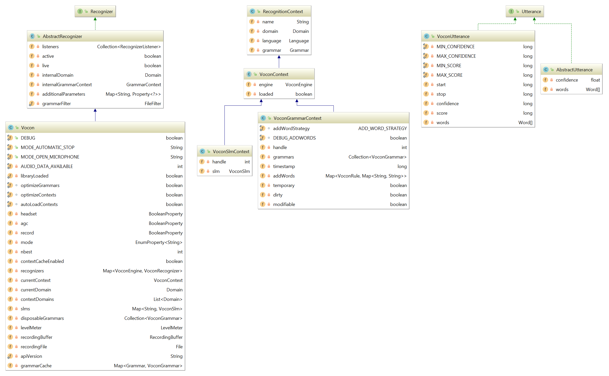

---
[Introduction](/developerdocumentation.html) &nbsp;&nbsp; [Architecture](architecture.html) &nbsp;&nbsp; [Execution Logger](execution-logger-implementation.html) &nbsp;&nbsp; [Gradle](gradle.html) &nbsp;&nbsp; [Groovy](groovy.html) &nbsp;&nbsp; [Localization](localization.html) &nbsp;&nbsp; [MaryTTS](marytts.html)  &nbsp;&nbsp; Vocon

---
&nbsp;

# Vocon

1. [Overview](#overview)

2. [Structure of the VoconPlugin](#structure-of-the-voconplugin)

3. [Replacing Vocon in DialogOS](#replacing-vocon-in-dialogos)

## Overview

Vocon is the yet to be replaced speech recognition package currently used by DialogOS. Developed by [Nuance](https://www.nuance.com/), it is used in a number of commercial applications.
Despite being technically superior to non-commercial speech recognition software, it will have to be replaced for DialogOS to be publically re-released.

## Structure of the VoconPlugin

The main functionality of Vocon is provided to DialogOS via the VoconPlugin package,
which in turn utilizes the functions found in the VoconClient package.

The VoconPlugin package consists of the following classes common among all DialogOS plugins:

- Plugin
- Resources
- Runtime
- Settings
- VoconNode
 
These five classes determine the general appearance and behaviour of and user-access to the speech recognizer while being used by DialogOS.
The four classes below govern the speech recognition capabilities of the plugin:

- VoconDevice
- LanguageName
- RecognitionThread
- MatchResult 

VoconDevice builds upon the Device class that was fomerly present in DialogOS. Its purpose is to provide an internal device, which can use the method receive() to receive sound.
LanguageName is used to assign an arbitrary string-identifier to an instance of the language class, so that it can be accessed at a later time by DialogOS,
for example if it is planned to use more than one language with DialogOS.

RecognitionThread functions to facilitate the actual speech recognition task and MatchResult assigns matches, i.e the product of checking recorded utterances against a pre-determined grammar, to edges.
MatchResult is being used in an internal Method within the primary method of RecognitionThread.

The basis for the functionality of VoconPlugin is the VoconClient package. It contains classes for the recognizer, grammars, utterances
and a number of smaller auxiliary classes that are being used by the Plugin.

The classes of the plugin that utilize elements from the VoconClient are as follows:

- Plugin
- VoconNode
- RecognitionThread

The Plugin class instantiates the Vocon speech recognizer and therefore contains a reference to the Vocon class from VoconClient and
since RecognitionThread handles the actual recognition process, it contains a reference to the Vocon class as well. VoconNode also references Vocon
as it needs to get the instance of Vocon from Plugin in Order to initiate RecognitionThread.
In summary, VoconPlugin only accesses the Vocon class from the VoconClient package. Any other interaction is concluded in between the classes of VoconPlugin and VoconClient, respectively.

 
The images below gives an idea about how VoconClient is structured internally:

It shall be noted, however, that if one wishes to change the way the VoconPlugin works, these changes should only be made in the VoconPlugin package.
Since Vocon is not functioning in its current state, in case there are diffiulties in modifying the existing plugin, it may be advisable to rather replace the entirety of Vocon with a different speech recognition software.

## Replacing Vocon in DialogOS

In order to integrate CMU Sphinx into the DialogOS software the developer has to rewrite several methods and classes within the project.
It seems undesirable, yet inevitable, to change the Vocon classes directly, since the main task at hand is to change the DialogOS VoconPlugin-package so that it uses CMU Sphinx and basic Java functions exclusively.
One of the possible starting points for such a project would be to first replace all uses and implementations of Vocon Classes with dummys. 
By doing that the developer is forced to change certain Vocon classes as well, since the confusing and sometimes outright random structure of DialogOS makes understanding the code horrendous.
Most of the attention should be directed at the recognition thread at first, since most of DialogOS core functions reside there.
If the structure is understood well enough it should be possible to start replacing a few functions with CMU Sphinx functions, which obviously has a working CMU Sphinx system or dummy as a prerequisite.
On an important note, the CMU Sphinx dummy should be able to be able to switch between languages and grammars during runtime, since that was an important feature of DialogOS, but not a basic feature of CMU Sphinx.
By slowly replacing code this way the most basic functions should be up and running in no time, but they may or may not be incompatible with the existing node. 
Since the node is the connection between the code and the user, it is of utmost importance to adjust the existing Node, so that it is compatible with CMU Sphinx and the new classes created for it.
It might even be easier and maybe necessary to create a new node entirely from scratch since the methods of Vocon and CMU Sphinx differ immensely and there my be copyright issues if the code is too similar to the original.

